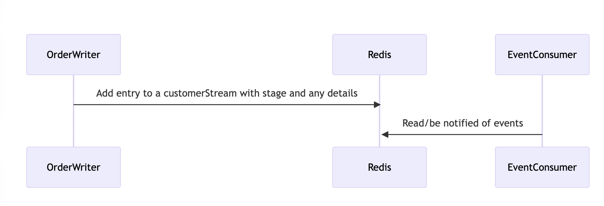
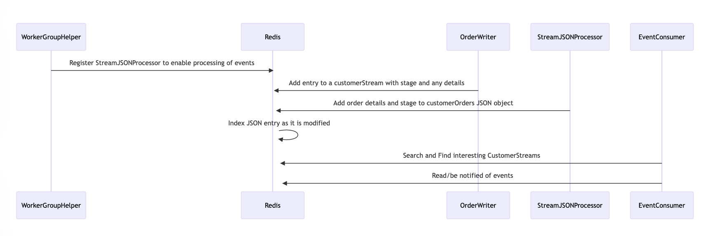

## This program is different from other Stream-based examples in that it uses potentially thousands  of Streams to allow for updates to thousands or millions of customerAccounts to be processed and consumed by interested Consumers 
### This program models a simple food delivery service
It shows how to create streams for each customer that will:
* 1) record their orders
* 2) notify any interested parties when the orders are at various stages:
*  - new
*  - accepted
*  - in_preparation
*  - out_for_delivery
*  - completed

## To run the program with the default settings (supplying the host and port for Redis) do:
```
mvn compile exec:java -Dexec.cleanupDaemonThreads=false -Dexec.args="--host <host> --port <port>"
```
## Note the program will not exit on its own as there are worker threads started and listening for Stream events

### * Using two or more separate shells, you can split the work up so that one instance runs the workers that consumer events, and the other writes new events

## --routingvaluecount determines how many streams are created
### 1. to run this program as an event consumer only with 2 workers/stream capable of handling 500 streams and 1000 connections use:
``` 
mvn compile exec:java -Dexec.cleanupDaemonThreads=false -Dexec.args="--host redis-10400.homelab.local --port 10400 --howmanyworkers 2 --maxconnections 1200 --workersleeptime 20 --howmanywriters 0 --routingvaluecount 500"
```

### 2. To run this program as an event-publisher only with 50 writer threads for a couple of thousand writes / second and with a large target # of entries

```
mvn compile exec:java -Dexec.cleanupDaemonThreads=false -Dexec.args="--host redis-10400.homelab.local --port 10400 --howmanyworkers 0 --howmanywriters 50 --howmanyentries 200000 --routingvaluecount 500"
```
### Note you can also specify --username and --password

### Initial State (implemented==Done) (before adding JSON and Search)

### Advanced State (implemented==in-progress) (after adding JSON and Search)



### An interested listener can register for realtime updates to a particular Stream

The Main class loops through random streams, picking up the last message written to each one.

You can easily Browse the Streams and other keys in Redis using RedisInsight

Various other arguments can be passed to this program (see the main method for the possible --argname options)

### Streams are now being processed and JSON objects being created for each one
--SCALING THIS APPROACH IS BEING INVESTIGATED
* the issue is with keeping millions of connections alive - not feasible
* tens of thousands of connections can be achieved against a large cluster with
robust network infrastructure
* better - might be to let the clients pull data from the JSON docs
* question - how to notify clients when something interesting occurs?
* answer - a team of worker threads could perform callbacks based on stream events they get
* so - scale the streams by region or something  
  (so not give each customer their own stream)
  and scale the workers on those streams outside of Redis
* TODO: Interested parties wanting a callback can register for callbacks
* workers deliver the callbacks - the workers scale outside of redis
* upon receiving a notification that there is interesting information available:

#### Clients can issue JSON calls to fetch the latest info....
```
JSON.ARRLEN customer_order_history:X:rouws::0000002700{0} order_stages
(integer) 2
```
#### Could be used by client to compare the info they have locally with the info available
#### They could then fetch the last element of such an array:
```
> JSON.GET customer_order_history:X:rouws::0000000200{200} order_stages[0]
"{\"order_cost\":39.95,\"item2\":\"Licorice\",\"contact_name\":\"Kiara Johns\",\"item1\":\"Broccolini\",\"stage\":\"new\",\"orderID\":\"rouws200order200__2\",\"item3\":\"Kudzu\"}"

> JSON.RESP customer_order_history:X:rouws::0000000200{200} order_stages[0].contact_name
"Kiara Johns"
```

### Clients may also want to search across multiple JSON docs for - let's say cancelled orders:
### You can add a search index using the following command:
``` 
FT.CREATE idx_rouws ON JSON PREFIX 1 customer_order_history:X SCHEMA $.RegionID AS region_id TAG $.order_stages[*].orderID AS order_id TAG SORTABLE $.order_stages[*].item1 AS item1 TAG $.order_stages[*].item2 AS item2 TAG $.order_stages[*].item3 AS item3 TAG $.order_stages[*].item4 AS item4 TAG $.order_stages[*].item5 AS item5 TAG $.order_stages[*].contact_name AS order_contact TEXT SORTABLE $.order_stages[*].order_cost AS order_cost NUMERIC SORTABLE $.order_stages[*].stage AS order_stage TAG SORTABLE
```

### You can search like this:

```
> FT.SEARCH idx_rouws @order_stage:{cancelled} return 6 '$.order_stages[?(@.stage =~ "cancelled")].orderID' AS MATCHING_ORDER '$.order_stages[?(@.stage =~ "cancelled")].stage' AS MATCHING_STAGE limit 0 1
1) "387"
2) "customer_order_history:X:rouws::0000000037{37}"
3) 1) "MATCHING_ORDER"
   2) "rouws37order37__31"
   3) "MATCHING_STAGE"
   4) "cancelled"

> FT.SEARCH idx_rouws "@order_id:{rouws37order37__31}" return 3 '$.order_stages[?(@.stage =~ "new")]' AS MATCHING_ORDER limit 0 1
1) "1"
2) "customer_order_history:X:rouws::0000000037{37}"
3) 1) "MATCHING_ORDER"
   2) "{\"order_cost\":49.94,\"item2\":\"Trout\",\"contact_name\":\"Miss Bartholome Turcotte\",\"item1\":\"Camembert\",\"stage\":\"new\",\"orderID\":\"rouws37order37__3\",\"item4\":\"Kiwi Fruit\",\"item3\":\"Brown Flour\"}"
```
### And Aggregate like this:
``` 
> FT.AGGREGATE idx_rouws "@item1:{Ham | Banana} @order_stage:{new}" GROUPBY 1 @order_cost REDUCE COUNT 0 AS number_matched LIMIT 0 2
1) "42"
2) 1) "order_cost"
   2) "40.95"
   3) "number_matched"
   4) "3"
3) 1) "order_cost"
   2) "41.95"
   3) "number_matched"
   4) "4"
```


